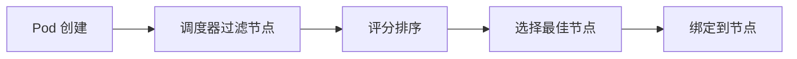

# 第一部分：核心概念讲解

## 一、Kubernetes 基础概念

### 1.1 什么是 Kubernetes？

**Kubernetes（K8s）** 是一个开源的容器编排平台，用于自动化部署、扩展和管理容器化应用。

**核心价值：**
- 🔄 自动化部署和扩展
- 🔧 自我修复（自动重启失败的容器）
- 📦 服务发现和负载均衡
- 💾 存储编排

### 1.2 核心概念

#### Pod（容器组）

**Pod 是 K8s 中最小的部署单元**，包含一个或多个容器。

```
Pod = 1个或多个容器 + 共享存储 + 网络命名空间
```

**特点：**
- Pod 内的容器共享网络和存储
- Pod 是临时性的，可以被创建和销毁
- 每个 Pod 有唯一的 IP 地址

#### Node（节点）

**Node 是运行 Pod 的工作机器**（物理机或虚拟机）。

```
Node = Kubelet（节点代理） + 容器运行时（Docker/containerd）
```

**节点类型：**
- **Master Node**: 控制节点，管理集群
- **Worker Node**: 工作节点，运行 Pod

#### Cluster（集群）

**Cluster 是由多个 Node 组成的集合**。

```
Cluster = Master Node + 多个 Worker Node
```

### 1.3 K8s 调度器（Scheduler）

**调度器的作用：** 决定 Pod 应该运行在哪个 Node 上。

**调度流程：**



**调度策略：**

1. **nodeSelector** - 简单标签匹配
   ```yaml
   nodeSelector:
     gpu.type: a100
   ```

2. **nodeAffinity** - 复杂标签匹配（必须/偏好）
   ```yaml
   affinity:
     nodeAffinity:
       requiredDuringSchedulingIgnoredDuringExecution:
         nodeSelectorTerms:
           - matchExpressions:
               - key: gpu.type
                 operator: In
                 values: ["a100"]
   ```

3. **Taints & Tolerations** - 节点污点和容忍度
   - Taint: 节点标记为"不接受某些 Pod"
   - Toleration: Pod 标记为"可以容忍某些 Taint"

**K8s 调度器的局限性：**
- ❌ 不支持批处理任务队列
- ❌ 不支持任务优先级和抢占
- ❌ 不支持任务依赖关系（DAG）
- ❌ GPU 调度能力有限

## 二、Volcano 是什么？

### 2.1 Volcano 简介

**Volcano** 是 Kubernetes 的**批处理调度器**，专门为 AI/ML 工作负载设计。

**为什么需要 Volcano？**

K8s 默认调度器适合：
- ✅ 长期运行的服务（如 Web 服务）
- ✅ 无状态应用

K8s 默认调度器不适合：
- ❌ 批处理任务（训练任务）
- ❌ 需要多个 Pod 同时启动的任务（Gang Scheduling）
- ❌ 有依赖关系的任务（工作流）

**Volcano 的优势：**
- ✅ 支持批处理任务（Job）
- ✅ 支持工作流（JobFlow）
- ✅ 支持任务优先级和抢占
- ✅ 支持资源队列管理
- ✅ 支持 Gang Scheduling（确保 Pod 组同时调度）

### 2.2 Volcano 核心概念

#### Job（任务）

**Job 是 Volcano 的基本任务单元**，类似 K8s Job，但功能更强大。

**关键特性：**

1. **minAvailable** - Gang Scheduling
   ```yaml
   minAvailable: 4  # 必须同时调度 4 个 Pod 才能开始
   ```

2. **queue** - 指定资源队列
   ```yaml
   queue: training-queue  # 使用训练队列
   ```

3. **policies** - 失败重试策略
   ```yaml
   policies:
     - event: PodFailed
       action: RestartJob
       maxRetry: 3
   ```

**Job vs K8s Job：**

| 特性 | K8s Job | Volcano Job |
|------|---------|-------------|
| Gang Scheduling | ❌ | ✅ |
| 队列管理 | ❌ | ✅ |
| 优先级 | ❌ | ✅ |
| 抢占 | ❌ | ✅ |

#### JobFlow（工作流）

**JobFlow 支持 DAG（有向无环图）工作流**，可以定义任务之间的依赖关系。

**示例：**

```yaml
flow:
  steps:
    - name: training      # 步骤1: 训练
      template: training-job
    - name: validation   # 步骤2: 验证
      template: validation-job
      dependsOn:         # 依赖训练任务
        - training
```

**工作流特点：**
- ✅ 支持任务依赖（dependsOn）
- ✅ 支持条件执行
- ✅ 支持失败重试

#### Queue（队列）

**Queue 是资源队列**，用于资源隔离和配额管理。

**队列的作用：**
- 📊 资源配额管理
- 🎯 优先级控制
- 🔒 资源隔离

**队列配置：**

```yaml
spec:
  weight: 10              # 队列权重（优先级）
  capability:             # 资源配额
    cpu: "1000"
    memory: "2000Gi"
    nvidia.com/gpu: "32"
  state: Open             # 队列状态
```

## 三、调度原理

### 3.1 资源 Locality Affinity 调度

**核心思想：** 根据任务资源偏向性，将任务调度到最合适的节点。

**三种资源偏向性：**

#### 1. CPU 密集任务（计算偏向）

**特点：**
- 需要大量 CPU 计算
- 例如：数据预处理、模型导出

**调度策略：**
- 优先选择：高 CPU 核心数
- 优先选择：低 CPU 使用率
- 优先选择：高 CPU 主频

#### 2. IO 密集任务（DiskIO 偏向）

**特点：**
- 需要高 IOPS、低延迟
- 例如：数据加载、模型加载

**调度策略：**
- 必须选择：SSD/NVMe 节点
- 优先选择：高 IOPS
- 优先选择：低磁盘使用率

#### 3. GPU 训推任务（GPU 偏向）

**特点：**
- 需要 GPU 计算
- 例如：模型训练、模型推理

**调度策略：**
- 必须选择：满足 GPU 类型要求
- 必须选择：满足显存要求
- 优先选择：低 GPU 使用率
- 优先选择：低 GPU 温度

### 3.2 节点资源标注机制

**节点通过两种方式记录资源信息：**

#### Labels（标签）- 静态特征

**特点：**
- 硬件特征，不变或很少变化
- 用于调度匹配

**示例：**

```yaml
# CPU 特征
cpu.cores: "64"
cpu.frequency: "2.4GHz"

# GPU 特征
gpu.type: "a100"
gpu.count: "8"
gpu.memory-per-card: "80GB"

# 存储特征
disk.type: "nvme"
disk.iops: "100000"
```

#### Annotations（注解）- 动态使用率

**特点：**
- 资源使用率，频繁更新
- 用于调度优化

**示例：**

```yaml
# CPU 使用率
metrics.cpu.utilization: "45%"
metrics.cpu.available-cores: "35"

# GPU 使用率
metrics.gpu.utilization: "60%"
metrics.gpu.memory-used: "48GB"
metrics.gpu.temperature: "75C"

# 存储使用率
metrics.disk.utilization: "70%"
metrics.disk.iops-used: "50000"

# 更新时间
metrics.last-update: "2024-01-15T10:30:00Z"
```

**更新机制：**
- 监控 Agent（DaemonSet）每 30 秒更新一次
- 从 Prometheus 获取指标
- 更新到节点 Annotations

### 3.3 调度策略配置

**使用 nodeAffinity 实现资源偏向性调度：**

```yaml
affinity:
  nodeAffinity:
    # 必须满足的条件（硬约束）
    requiredDuringSchedulingIgnoredDuringExecution:
      nodeSelectorTerms:
        - matchExpressions:
            - key: gpu.type
              operator: In
              values: ["a100"]
    
    # 偏好条件（软约束，评分）
    preferredDuringSchedulingIgnoredDuringExecution:
      - weight: 100  # 权重越高，优先级越高
        preference:
          matchExpressions:
            - key: metrics.gpu.utilization
              operator: Lt
              values: ["60%"]
```

**调度流程：**

```
1. 过滤节点（required 条件）
   ↓
2. 评分排序（preferred 条件）
   ↓
3. 选择最佳节点
   ↓
4. 调度 Pod
```

## 四、最佳实践

### 4.1 队列设计原则

**原则1：按任务类型划分队列**

```
training-queue    → 训练任务（高优先级）
inference-queue   → 推理任务（中优先级）
export-queue      → 导出任务（低优先级）
```

**原则2：设置合理的资源配额**

```yaml
capability:      # 最大配额（不要超过集群总资源）
  cpu: "1000"
  nvidia.com/gpu: "32"

guarantee:       # 资源保证（确保关键任务有资源）
  cpu: "500"
  nvidia.com/gpu: "16"
```

**原则3：队列优先级**

```yaml
weight: 10  # 值越大优先级越高
```

### 4.2 节点标签规范

**命名规范：**
- 使用小写字母和连字符
- 格式：`<资源类型>.<属性名>`
- 示例：`gpu.type`, `cpu.cores`, `disk.type`

**标签分类：**
- **硬件特征**（Labels）: 不变或很少变化
- **使用率**（Annotations）: 频繁更新（每 30 秒）

### 4.3 工作流设计

**原则1：任务依赖**

```yaml
dependsOn:
  - training  # 依赖训练任务
```

**原则2：失败处理**

```yaml
policies:
  - event: PodFailed
    action: RestartJob
    maxRetry: 3  # 最多重试 3 次
```

**原则3：资源分配**

```yaml
resources:
  requests:  # 请求的资源（必须满足）
    cpu: "4"
    nvidia.com/gpu: "1"
  limits:    # 资源上限（不能超过）
    cpu: "8"
    nvidia.com/gpu: "1"
```

## 五、MVP 最小实现

### 5.1 MVP 范围

**核心功能：**
- ✅ Volcano 基础安装
- ✅ 一个训练队列
- ✅ 简单的训练任务（单阶段）
- ✅ 节点标签标注
- ✅ 基本的 GPU 调度策略

**暂不包含：**
- ❌ 完整工作流（JobFlow）
- ❌ 多队列管理
- ❌ 监控和告警
- ❌ CI/CD 集成
- ❌ 模型版本管理

### 5.2 MVP 架构

```
用户提交训练任务
    ↓
Volcano Job（单阶段）
    ↓
训练队列（training-queue）
    ↓
调度到 GPU 节点
    ↓
执行训练
```

### 5.3 MVP 文件结构

```
volcano_workflow/
├── docs/
│   ├── 01-concepts.md          # 概念讲解（本文档）
│   ├── 02-principles.md        # 原理详解
│   └── 03-best-practices.md     # 最佳实践
├── manifests/
│   ├── volcano/                # Volcano 安装
│   └── queues/                # 队列定义
├── examples/
│   └── training-job-mvp.yaml   # 训练任务示例
├── scripts/
│   └── label-nodes.sh         # 节点标签标注
└── README.md                   # 快速开始
```

## 六、学习路径

### 阶段1：理解概念（当前）
- ✅ K8s 基础概念
- ✅ Volcano 核心概念
- ✅ 调度原理

### 阶段2：MVP 实践
- ⏭️ 安装 Volcano
- ⏭️ 创建队列
- ⏭️ 提交简单任务
- ⏭️ 验证调度

### 阶段3：扩展功能
- ⏭️ 添加工作流
- ⏭️ 多队列管理
- ⏭️ 监控集成

## 参考资源

- [Kubernetes 官方文档](https://kubernetes.io/docs/)
- [Volcano 官方文档](https://volcano.sh/docs/)
- [K8s 调度器扩展](https://kubernetes.io/docs/concepts/scheduling-eviction/scheduling-framework/)

