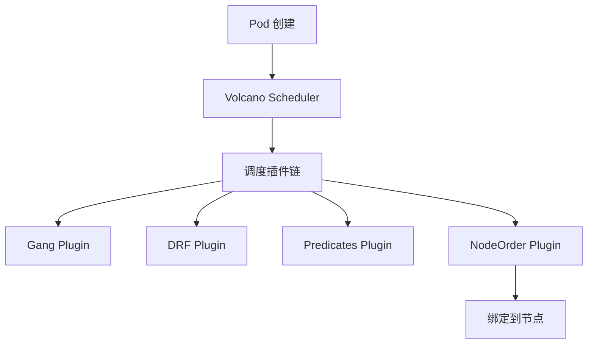
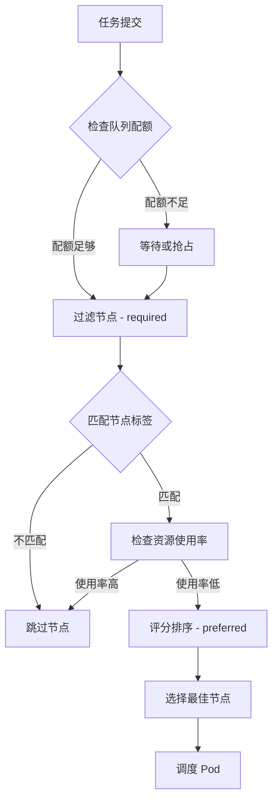
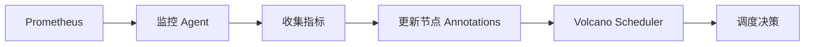

# 第二部分：原理详解

## 一、Volcano 调度原理

### 1.1 Volcano 调度器架构

**Volcano 调度器是 K8s 调度器的扩展**，通过调度框架（Scheduling Framework）集成。

**架构图：**



**调度插件：**

1. **Gang Plugin** - Gang Scheduling
   - 确保 Pod 组同时调度
   - 如果无法同时调度所有 Pod，则不调度任何 Pod

2. **DRF Plugin** - Dominant Resource Fairness
   - 公平资源分配
   - 根据主导资源（CPU/GPU）分配

3. **Predicates Plugin** - 节点过滤
   - 过滤不满足条件的节点
   - 例如：GPU 类型、显存要求

4. **NodeOrder Plugin** - 节点排序
   - 对节点进行评分排序
   - 选择最佳节点

### 1.2 Gang Scheduling 原理

**问题：** 分布式训练需要多个 Pod 同时启动，如果只启动部分 Pod，训练无法进行。

**解决方案：** Gang Scheduling - 要么全部调度，要么都不调度。

**示例：**

```yaml
minAvailable: 4  # 需要 4 个 Pod
tasks:
  - replicas: 4  # 4 个 Pod
```

**调度流程：**

```
1. 检查是否有 4 个可用节点
   ↓
2. 如果有，同时调度 4 个 Pod
   ↓
3. 如果没有，等待或抢占
```

**优势：**
- ✅ 避免资源浪费（部分 Pod 等待）
- ✅ 提高训练效率（同时启动）

### 1.3 队列资源管理原理

**队列的作用：**

1. **资源配额管理**
   ```yaml
   capability:
     cpu: "1000"        # 最大 1000 核 CPU
     nvidia.com/gpu: "32"  # 最大 32 个 GPU
   ```

2. **资源保证**
   ```yaml
   guarantee:
     cpu: "500"         # 保证 500 核 CPU
     nvidia.com/gpu: "16"  # 保证 16 个 GPU
   ```

3. **优先级控制**
   ```yaml
   weight: 10  # 权重越高，优先级越高
   ```

**资源分配流程：**

```
1. 检查队列配额
   ↓
2. 如果配额足够，分配资源
   ↓
3. 如果配额不足，等待或抢占
```

## 二、资源 Locality Affinity 调度原理

### 2.1 调度决策流程

**完整流程：**



### 2.2 节点过滤（Predicates）

**required 条件 - 硬约束：**

```yaml
requiredDuringSchedulingIgnoredDuringExecution:
  nodeSelectorTerms:
    - matchExpressions:
        - key: gpu.type
          operator: In
          values: ["a100"]
```

**过滤逻辑：**
- 如果节点不满足 required 条件，直接排除
- 只有满足所有 required 条件的节点才会进入下一步

**示例：**
- 节点1: `gpu.type=a100` ✅ 通过
- 节点2: `gpu.type=v100` ❌ 排除
- 节点3: 无 GPU 标签 ❌ 排除

### 2.3 节点评分（Priorities）

**preferred 条件 - 软约束：**

```yaml
preferredDuringSchedulingIgnoredDuringExecution:
  - weight: 100
    preference:
      matchExpressions:
        - key: metrics.gpu.utilization
          operator: Lt
          values: ["60%"]
```

**评分逻辑：**
- 每个 preferred 条件都有权重（weight）
- 满足条件的节点获得相应分数
- 最终选择分数最高的节点

**示例：**

| 节点 | GPU 使用率 | 分数 |
|------|-----------|------|
| 节点1 | 45% | 100 |
| 节点2 | 70% | 0 |
| 节点3 | 55% | 100 |

**选择节点1或节点3（分数相同，随机选择）**

### 2.4 资源使用率更新原理

**更新流程：**



**更新频率：**
- 每 30 秒更新一次
- 平衡实时性和性能

**数据来源：**
- Prometheus Node Exporter（CPU、内存、磁盘）
- GPU Exporter（nvidia-smi、dcgm）
- 自定义存储监控工具（IOPS、带宽）

## 三、工作流执行原理

### 3.1 DAG 依赖解析

**JobFlow 解析依赖关系：**

```yaml
steps:
  - name: training
    template: training-job
  - name: validation
    template: validation-job
    dependsOn:
      - training  # 依赖训练任务
```

**执行流程：**

```
1. 解析依赖关系
   ↓
2. 构建 DAG（有向无环图）
   ↓
3. 拓扑排序
   ↓
4. 按顺序执行任务
```

**DAG 示例：**

```
training → validation → export → inference-test → publish
```

### 3.2 任务状态管理

**任务状态：**

- **Pending** - 等待调度
- **Running** - 运行中
- **Completed** - 完成
- **Failed** - 失败
- **Aborted** - 中止

**状态转换：**

```
Pending → Running → Completed
         ↓
       Failed → Restart (if retry)
         ↓
       Aborted
```

### 3.3 失败重试策略

**重试策略：**

```yaml
policies:
  - event: PodFailed
    action: RestartJob
    maxRetry: 3
```

**重试逻辑：**
- 如果 Pod 失败，触发重试
- 最多重试 maxRetry 次
- 如果超过最大重试次数，任务失败

## 四、资源调度优化原理

### 4.1 Bin Packing 算法

**目标：** 最大化资源利用率

**策略：**
- 优先选择资源使用率高的节点
- 减少碎片化

**示例：**

```
节点1: CPU 80% 使用 → 优先选择
节点2: CPU 20% 使用 → 次选
```

### 4.2 优先级抢占原理

**抢占流程：**

```
1. 高优先级任务提交
   ↓
2. 检查资源是否足够
   ↓
3. 如果不足，抢占低优先级任务
   ↓
4. 释放资源给高优先级任务
```

**抢占条件：**
- 高优先级任务无法调度
- 低优先级任务可以抢占（reclaimable: true）

### 4.3 资源预留原理

**预留机制：**

```yaml
guarantee:
  cpu: "500"
  nvidia.com/gpu: "16"
```

**预留逻辑：**
- 为队列预留一定资源
- 即使集群资源紧张，也保证预留资源可用
- 其他队列无法使用预留资源

## 五、性能优化原理

### 5.1 调度性能优化

**优化策略：**

1. **节点过滤优化**
   - 先过滤不满足条件的节点
   - 减少评分节点数量

2. **评分算法优化**
   - 使用缓存减少重复计算
   - 并行评分

3. **批量调度**
   - 一次调度多个 Pod
   - 减少调度次数

### 5.2 资源利用率优化

**优化策略：**

1. **资源预留**
   - 为关键任务预留资源
   - 避免资源竞争

2. **资源回收**
   - 回收未使用的资源
   - 提高资源利用率

3. **抢占调度**
   - 低优先级任务可以被抢占
   - 提高高优先级任务调度成功率

## 六、故障恢复原理

### 6.1 Pod 故障恢复

**恢复机制：**

```yaml
policies:
  - event: PodEvicted
    action: RestartJob
```

**恢复流程：**
- Pod 被驱逐 → 触发 RestartJob
- 重新创建 Pod
- 继续执行任务

### 6.2 节点故障恢复

**恢复机制：**
- K8s 自动检测节点故障
- 将 Pod 重新调度到其他节点
- Volcano 确保 Gang Scheduling

### 6.3 工作流故障恢复

**恢复策略：**

```yaml
policies:
  - event: TaskFailed
    action: AbortJobFlow
    maxRetry: 2
```

**恢复流程：**
- 任务失败 → 触发重试
- 如果超过最大重试次数 → 中止工作流
- 清理资源

## 参考

- [Volcano 调度器源码](https://github.com/volcano-sh/volcano)
- [K8s 调度框架](https://kubernetes.io/docs/concepts/scheduling-eviction/scheduling-framework/)

