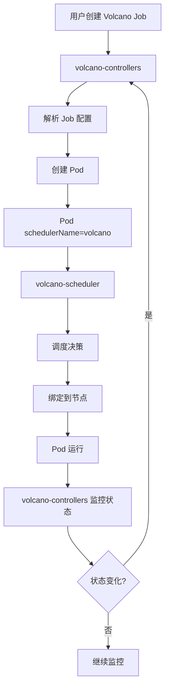

# 第四部分：Volcano 组件详解

## 一、Volcano 架构组件

Volcano 项目包含两个核心组件：

### 1.1 volcano-scheduler（调度器）

**本质：** 调度器（Scheduler），不是 Controller

**作用：** 负责 Pod 的调度决策

**工作流程：**

```
Pod 创建（schedulerName=volcano）
    ↓
volcano-scheduler 接收调度请求
    ↓
执行调度插件链（Gang、DRF、Predicates、NodeOrder）
    ↓
选择最佳节点
    ↓
绑定 Pod 到节点
```

**关键特性：**
- ✅ 替代/扩展 K8s 默认调度器
- ✅ 支持 Gang Scheduling
- ✅ 支持优先级和抢占
- ✅ 支持资源队列管理

**与 K8s Scheduler 的关系：**
- Volcano Scheduler 是 K8s Scheduler 的**替代品**
- 当 Pod 指定 `schedulerName: volcano` 时，由 Volcano Scheduler 调度
- 否则仍由 K8s 默认调度器调度

### 1.2 volcano-controllers（控制器）

**本质：** Controller（控制器）

**作用：** 管理 Volcano 自定义资源（Job、JobFlow、Queue 等）

**工作流程：**

```
用户创建 Volcano Job/JobFlow
    ↓
volcano-controllers 监听资源变化
    ↓
解析 Job/JobFlow 配置
    ↓
创建对应的 K8s Pod
    ↓
管理 Pod 生命周期
```

**关键特性：**
- ✅ 管理 Volcano Job 资源
- ✅ 管理 JobFlow 工作流
- ✅ 管理 Queue 队列
- ✅ 处理任务依赖关系
- ✅ 执行失败重试策略

**与 K8s Controller 的关系：**
- 类似 K8s 的 Deployment Controller、Job Controller
- 通过 Controller Pattern 实现
- 监听资源变化并采取行动

## 二、Scheduler vs Controller

### 2.1 核心区别

| 特性 | Scheduler（调度器） | Controller（控制器） |
|------|-------------------|---------------------|
| **本质** | 调度器 | 控制器 |
| **作用** | 决定 Pod 运行在哪个节点 | 管理资源生命周期 |
| **触发时机** | Pod 创建时 | 资源变化时 |
| **工作方式** | 被动响应调度请求 | 主动监听资源变化 |
| **输入** | Pod 调度请求 | 资源状态变化 |
| **输出** | Pod 节点绑定 | 资源状态更新 |

### 2.2 工作模式对比

**Scheduler（调度器）模式：**

```
被动响应
  ↓
接收调度请求
  ↓
执行调度决策
  ↓
返回调度结果
```

**Controller（控制器）模式：**

```
主动监听
  ↓
监听资源变化
  ↓
对比期望状态和实际状态
  ↓
采取行动（Reconcile）
  ↓
更新资源状态
```

### 2.3 在 Volcano 中的协作

**完整流程：**



## 三、组件详细说明

### 3.1 volcano-scheduler 详解

**架构：**

```
volcano-scheduler
    ↓
调度框架（Scheduling Framework）
    ↓
调度插件链
    ├── Gang Plugin（Gang Scheduling）
    ├── DRF Plugin（公平资源分配）
    ├── Predicates Plugin（节点过滤）
    ├── NodeOrder Plugin（节点排序）
    └── Preempt Plugin（抢占）
```

**调度流程：**

1. **Enqueue** - 将 Pod 加入调度队列
2. **Filter** - 过滤不满足条件的节点（Predicates）
3. **Score** - 对节点评分排序（NodeOrder）
4. **Bind** - 绑定 Pod 到最佳节点

**配置：**

```yaml
# scheduler-config.yaml
actions: "enqueue, allocate, backfill"
tiers:
  - plugins:
      - name: gang      # Gang Scheduling
      - name: priority  # 优先级
  - plugins:
      - name: drf       # 公平资源分配
      - name: predicates # 节点过滤
      - name: nodeorder  # 节点排序
```

### 3.2 volcano-controllers 详解

**架构：**

```
volcano-controllers
    ↓
多个 Controller
    ├── Job Controller（管理 Volcano Job）
    ├── JobFlow Controller（管理 JobFlow）
    ├── Queue Controller（管理 Queue）
    └── PodGroup Controller（管理 PodGroup）
```

**Controller Pattern：**

```go
// 伪代码示例
for {
    // 1. 获取资源当前状态
    currentState := getResourceState()
    
    // 2. 获取资源期望状态
    desiredState := getDesiredState()
    
    // 3. 对比状态
    if currentState != desiredState {
        // 4. 采取行动（Reconcile）
        reconcile(currentState, desiredState)
    }
    
    // 5. 等待一段时间
    sleep(interval)
}
```

**工作流程：**

1. **监听资源变化** - 通过 Informer 监听 K8s API
2. **解析配置** - 解析 Job/JobFlow 配置
3. **创建 Pod** - 根据配置创建 K8s Pod
4. **管理生命周期** - 监控 Pod 状态，处理失败重试
5. **更新状态** - 更新 Job/JobFlow 状态

## 四、组件部署

### 4.1 部署方式

**使用 Helm 部署：**

```bash
helm install volcano volcano/volcano \
    --namespace volcano-system \
    --set scheduler.schedulerName=volcano \
    --create-namespace
```

**部署的组件：**

1. **volcano-scheduler** - Deployment
   - 副本数：通常 1 个（可以多个实现高可用）
   - 镜像：volcanosh/vc-scheduler

2. **volcano-controllers** - Deployment
   - 副本数：通常 1 个（可以多个实现高可用）
   - 镜像：volcanosh/vc-controller-manager

### 4.2 验证部署

**检查组件状态：**

```bash
# 查看所有组件
kubectl get pods -n volcano-system

# 查看调度器
kubectl get pods -n volcano-system -l app=volcano-scheduler

# 查看控制器
kubectl get pods -n volcano-system -l app=volcano-controllers
```

**预期结果：**

```
NAME                                    READY   STATUS    RESTARTS   AGE
volcano-scheduler-xxx                   1/1     Running   0          5m
volcano-controllers-xxx                 1/1     Running   0          5m
```

## 五、常见问题

### Q1: 为什么需要两个组件？

**A:** 职责分离
- **Scheduler** 专注于调度决策（哪个节点）
- **Controller** 专注于资源管理（创建、更新、删除）

### Q2: 如果只部署 Scheduler 会怎样？

**A:** 
- ✅ Pod 可以正常调度
- ❌ 无法创建和管理 Volcano Job/JobFlow
- ❌ 无法使用队列功能

### Q3: 如果只部署 Controller 会怎样？

**A:**
- ✅ 可以创建 Volcano Job/JobFlow
- ❌ Pod 无法被调度（没有调度器）
- ❌ 无法使用 Gang Scheduling 等功能

### Q4: 两个组件可以独立扩展吗？

**A:** 可以
- Scheduler 可以部署多个副本实现高可用
- Controller 可以部署多个副本实现高可用
- 但通常各部署 1 个副本即可

## 六、最佳实践

### 6.1 部署建议

**生产环境：**
- Scheduler: 2-3 个副本（高可用）
- Controller: 2-3 个副本（高可用）

**开发/测试环境：**
- Scheduler: 1 个副本
- Controller: 1 个副本

### 6.2 监控建议

**监控指标：**
- Scheduler: 调度延迟、调度成功率
- Controller: Reconcile 延迟、资源同步状态

**告警规则：**
- Scheduler 不可用
- Controller 不可用
- 调度延迟过高
- Reconcile 失败

## 参考

- [Volcano 架构文档](https://volcano.sh/docs/architecture/)
- [K8s Controller Pattern](https://kubernetes.io/docs/concepts/architecture/controller/)
- [K8s Scheduling Framework](https://kubernetes.io/docs/concepts/scheduling-eviction/scheduling-framework/)

